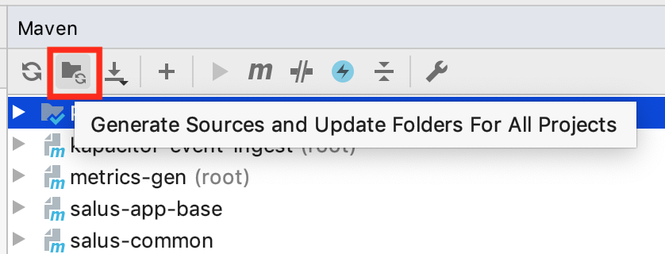
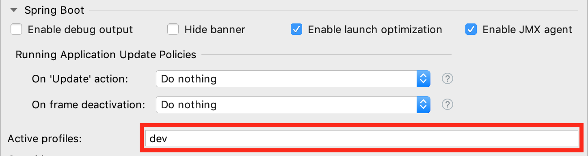
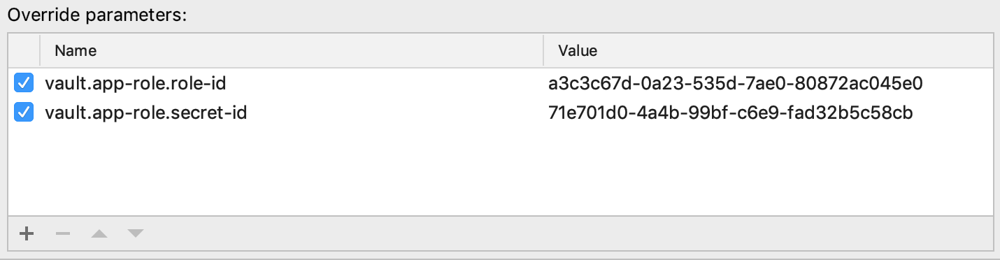
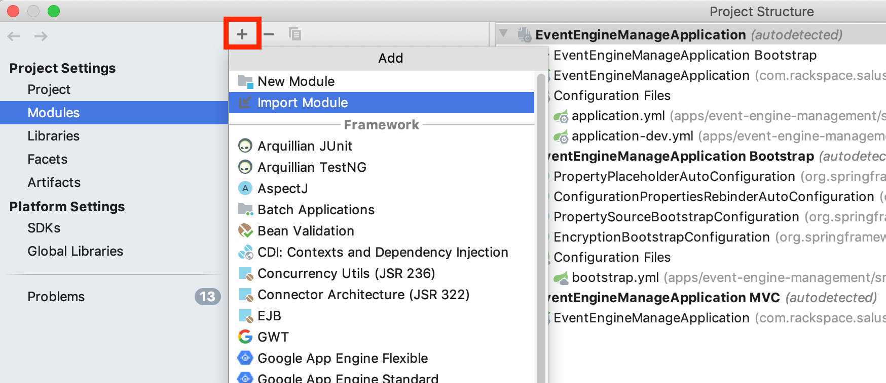
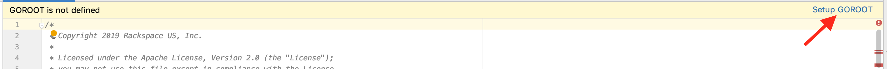
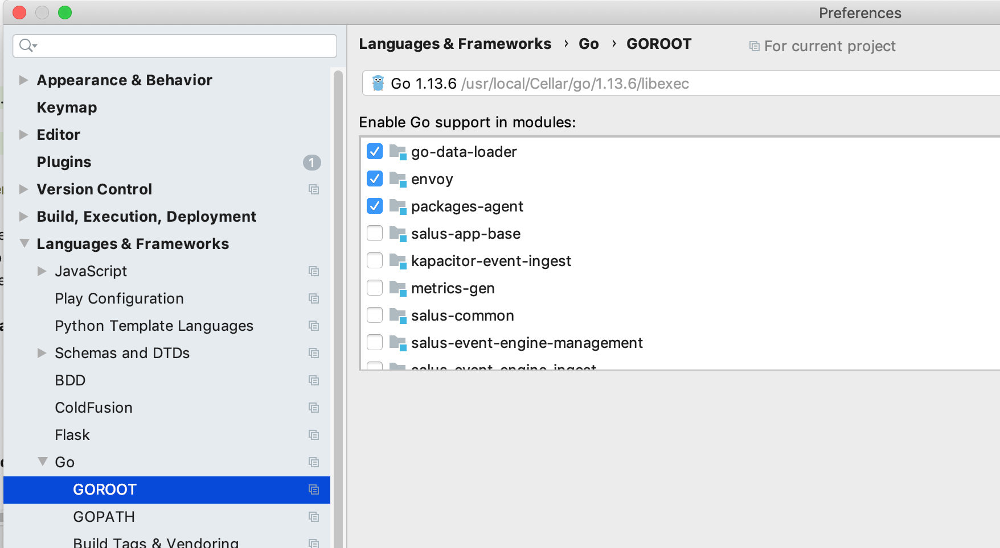
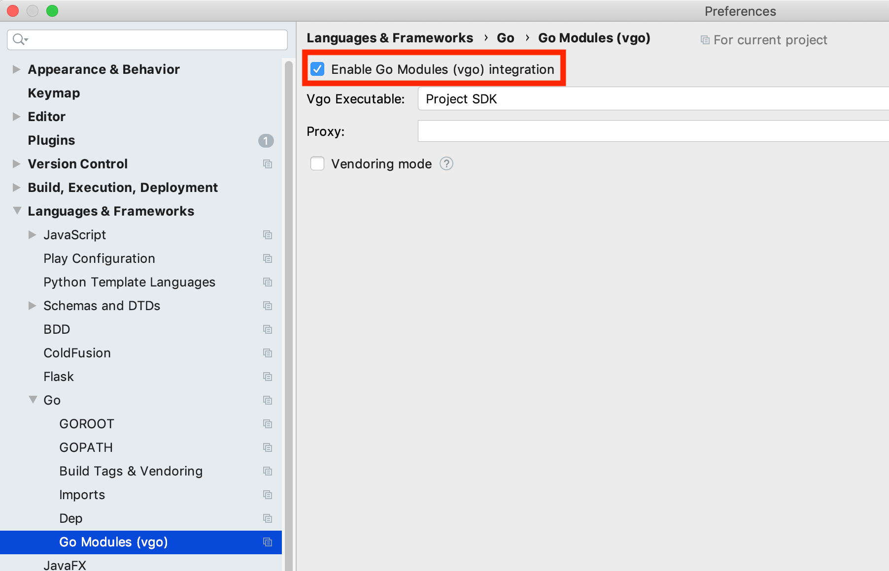
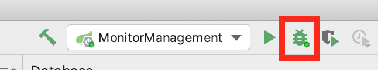

## Cloning the git submodules
```
git clone --recursive git@github.com:racker/salus-telemetry-bundle.git
```
### Pulling in submodule changes
Running `git submodule update --recursive` in the top level directory will set each submodule to the commit tagged in this repo.
```
$ git submodule update --recursive
Submodule path 'apps/ambassador': checked out '8fd6d17993001a0d5555f88dc1593ba56ff1ca4c'
Submodule path 'apps/salus-app-base': checked out 'c3b64afad4e2d31c775a7ce40803df1a7dc95630'

$ git submodule status
 8fd6d17993001a0d5555f88dc1593ba56ff1ca4c apps/ambassador (8fd6d17)
 0d434d08dc31c73918dc5a5b09d11ae503ae6f13 apps/api (heads/master)
 7fec0125daaa1d6554a405dab5e761ebfa98df0a apps/auth-service (heads/master)
 c999f7e314c3e267a8a9a343c60b8d7a23523e2e apps/envoy (0.1.1-39-gc999f7e)
 c3b64afad4e2d31c775a7ce40803df1a7dc95630 apps/salus-app-base (c3b64af)
 419171514ce8dc0d823ffe32431d255cdc684de6 libs/etcd-adapter (heads/master)
 8d3b86933450af562dc57c1fc2a9bf7005bf65b3 libs/model (heads/master)
```

If you wish to update all submodules to the head of their own master branch, you can append `--remote` to that command.
```
$ git submodule update --recursive --remote
...
...

$ git submodule status
+90b4454c51f1e045a4dd658a1c598ea2b7909391 apps/ambassador (remotes/origin/HEAD)
+af599bedbedab08c2c99e3700a37ab19ded5b649 apps/api (remotes/origin/HEAD)
+08fb8a1686addf8ecfe1ca9e212c4e26f0eac99a apps/auth-service (remotes/origin/HEAD)
 c999f7e314c3e267a8a9a343c60b8d7a23523e2e apps/envoy (0.2.0)
+c670acff016f58734e0dae7d5de815e173003052 apps/salus-app-base (heads/master)
+35587ab173d6a1d8e55a022233b6c0dcb9a39cda libs/etcd-adapter (remotes/origin/HEAD)
+9b54cba9ca40b560f333ea63c9644c2e18465c46 libs/model (remotes/origin/HEAD)
```

## Manually creating a new release / version

### Create a PR
This is the easy part of dealing with submodules.  Typically you want to ensure all submodules are on their master branch and up to date, then it is just a matter of creating a new PR as normal.

Checking out the master branch of all submodules can be done via `git submodule foreach --recursive git checkout master`
and then you can update to the latest commit via `git submodule foreach --recursive git pull`.

A `git status` will then show something like:
```
	modified:   apps/ambassador (new commits)
	modified:   apps/api (new commits)
	modified:   apps/auth-service (new commits)
	modified:   apps/envoy (new commits)
```
and you can simply add those to your branch like any other file, add a commit message, and push your branch, followed by creating a PR.

### Create a Release
Once the PR is merged you can then [create a new release via GitHub](https://github.com/racker/salus-telemetry-bundle/releases/new), enter the new tag version, and fill in the other details with relevant information - see the previous releases for examples.

Publish the release and you are done.

## Running/Developing Locally

There a few different options for running the applications locally.

 * To run all services via docker, optionally including Repose, see [here](/dev/telemetry-apps)
 * To run Repose in front of the public api see [here](/dev/repose-api-public)
 * To run Repose in front of the admin api see [here](/dev/repose-api-admin)
 * To run Repose in front of the auth api see [here](/dev/repose-authserv)

The below information explains the most common dev scenario of running Salus applications locally in an IDE while using docker to start the required 3rd party services.

### Infrastructure

The supporting infrastructure, such as etcd and kafka, can be started by running

```
cd dev/telemetry-infra
docker-compose up -d
```

You can stop the infrastructure by running the following in that same directory:

```
docker-compose down
```

Add `-v` to that invocation to also remove the volumes allocated for the services.

You can watch the logs of any (or all) of the services in the composition using:

```
docker-compose logs -f service ...
```

such as

```
docker-compose logs -f kafka
```

### Pre-loading monitor translations, etc

Some integration points in the system, especially telegraf's usage of rendered monitor content, assume certain database content is present. In the deployed clusters, the data-loader is integrated with Github webhooks; however, for local development, a fresh database volume needs to be pre-loaded manually using the data-loader. Once all salus management and api applications are running, that can be done at any time using the following:

```
cd tools/data-loader
go run ./... --debug --admin-url http://localhost:8888 \
  load-from-git https://github.com/Rackspace-Segment-Support/salus-data-loader-content.git
```

### Applications

> The following procedure is IntelliJ specific but the process will be similar for other IDEs.

To open the project in IntelliJ, use the "open" option from the intro window, (or the File->Open dropdown).  Do not use either "Create New Project" or "Import Project" options, as those will misconfigure the project.  Open the root directory of this project, (the same one this readme is located in.)

In the "Maven Projects" tab (usually on right side of IDE window), click the "Generate Sources and Update Folders"
button to generate the protobuf/grpc code that is located in the `libs/protocol` module. That button is shown here:



IntelliJ, as of at least 2019.3, will auto-create run configurations for each of our Spring Boot applications under the `app` directory; however, you will need to add `dev` to the active Spring profiles as shown here:



The run configuration for `apps/auth-service` also needs the following "Override Parameters" set to the values returned by the [setup-app-role.sh script](#setting-up-vault-for-development-usage):
```
  vault.app-role.role-id
  vault.app-role.secret-id
```

The run configuration for `apps/ambassador` also needs the "Working directory" set to the `dev` directory of this bundle module. That will ensure it can read the development-time certificates from the `certs` directory contained there.

For example:


Go based modules, such as `apps/envoy`, may not be auto-detected as modules initially. If that's the case, then open the Project Structure configuration and perform an "Import Module" operation as shown here:



With that, when opening any of the *.go files within those modules, you should be prompted to setup the GOROOT, such as:



If not, you can manually enable Go support for modules in the project preferences as shown here:



Finally, IntelliJ should auto-enable support for Go modules; however, if it doesn't you can set (or check) that setting also in the project preferences, as shown here:



Launch each of the run configurations by choosing it from the drop down in the top-right of the IDE window
and clicking the "Run" or "Debug" button to launch in the respective mode. It is recommended you use debug mode in
most cases since you can add breakpoints on the fly:



### Maven usage for applications

The [app base README](apps/salus-app-base/README.md) contains information about how to build
and run the application modules with Maven.

### Setting up Vault for development usage

The Vault server itself is already included in the Docker "infra" composition.

With that container already running, run the following to setup app-role authentication 
to be used by the Salus applications:

```bash
docker exec -it telemetry-infra_vault_1 setup-app-role
```

## Interacting with local infrastructure services
While debugging issues it can be helpful to view what the applications running it docker are doing.

### Consuming from a kafka topic

To verify topic content is flowing and correct, you can exec into the kafka container and
run the standard console consumer, such as

```bash
docker exec -it telemetry-infra_kafka_1 \
  kafka-console-consumer --bootstrap-server localhost:9093 --topic telemetry.metrics.json
```

**NOTE** the use of port 9093 instead of 9092

### Querying etcd

The etcd container includes the `etcdctl` command-line tool and is pre-configured to use the v3
API. You can perform operations with `etcdctl` via `docker exec`, such as:

```bash
docker exec -it telemetry-infra_etcd_1 etcdctl get --prefix /
```

### Connecting to MySQL

The MySQL container contains a database named `default` with username `dev` and password `pass`.

Once running, in addition to connecting services to it, you can connect to the instance and query the database manually:

```
$ docker ps
docker CONTAINER ID        IMAGE                             COMMAND                  CREATED             STATUS              PORTS                               NAMES
fd12115575bd        mysql:5.7                         "docker-entrypoint.s…"   12 days ago         Up 12 days          0.0.0.0:3306->3306/tcp, 33060/tcp   telemetry-infra_mysql_1

$ docker exec -it telemetry-infra_mysql_1 sh

# mysql -u dev -ppass

mysql> use default;

mysql> show tables;
+--------------------+
| Tables_in_default  |
+--------------------+
| hibernate_sequence |
| labels             |
| resource_labels    |
| resources          |
+--------------------+

mysql> select * from resources;
```

### Running Event Engine with simulated metrics

The Event Engine applications (`event-engine-ingest` and `event-engine-management`) can be run locally
along with the entire end-to-end of Salus applications, Ambassador, Envoy, etc; however, for
development and testing of just the Event Engine piece it is easier just to simulate the
metrics that would normally  be routed to Kafka/UMB by the Ambassador.

To start with, ensure you have the infrastructure components runnings by bringing up the
Docker composition `dev/telemetry-infra/docker-compose.yml`. That composition includes two
instances of Kapacitor.

With the infrastructure running, start the `event-engine-ingest` and `event-engine-management`
applications both with the Spring `dev` profile activated. That profile will ensure the 
applications are configured to interact with the two Kapacitor instances in the infrastructure
composition.

Finally, to simulate some metrics, run the application located in `dev/metrics-gen`. For IntelliJ
to recognize that module, you'll need to right click its `pom.xml` and choose "Add as Maven project".
With it added to the overall project build, you'll be able to run it as a typical Spring Boot application.

That application will randomly pick a set of resources with a set of labels each. Within each resource it will
randomly come up with a sine wave definition of measurements for each. The logs at startup
will display the resources and measurements that were randomly defined. The variability and
number of those can be configured in the `application.yml` of that application. A `small` profile
is provided as an example of a variation of the application configuration.

As a result, you will be
able to pick any one of the resource+measurement combinations and configure event scenarios,
such as rising/falling threshold, based on the periodicity of the chosen measurement.

## Recommended IntelliJ Plugins

* .env files support (0.7)
* Apache Avro™ support (0.3.1)
* BashSupport (1.6.13.182)
* Docker integration (182.4323.18)
* Go (182.4129.55.890)
* [HashiCorp Terraform / HCL language support](https://plugins.jetbrains.com/plugin/7808-hashicorp-terraform--hcl-language-support)
* Kubernetes (182.3588)
* Lombok Plugin (0.19-LATEST-EAP-SNAPSHOT)
* Lua (1.0.114)
* Makefile support (1.3)
* Markdown support (182.4505.7)
* Maven Helper (3.7.172.1454.3)
* Protobuf Support (0.11.0)
* [RegexpTester](https://plugins.jetbrains.com/plugin/2917-regexptester)
* Spring Boot (1.0)
* Toml (0.2.0.19)

## Publishing Docker images to GCR

Use [the preparation part of these docs](https://cloud.google.com/container-registry/docs/pushing-and-pulling) 
to install the Cloud SDK tools and configure Docker for authentication. You can disregard the 
details about `docker push` since the [Maven jib plugin](https://github.com/GoogleContainerTools/jib/tree/master/jib-maven-plugin)
will take of the equivalent operations.

**Tip:** on MacOS you can install the Cloud SDK using brew:

```bash
brew cask install google-cloud-sdk
```

In each of the application modules, run the following replacing `$PROJECT_ID` with the Google
Cloud project's ID, which is of the form of an identifer and number separated by a dash:

```
mvn -P docker -Ddocker.image.prefix=gcr.io/$PROJECT_ID deploy
```

If publishing a snapshot version of the Maven projects, then add

```
-Dmaven.deploy.skip=true
```

to skip the Bintray publishing of the Maven artifacts.

If the local system doesn't have Docker installed, you can still perform the remote publish and
skip the local Docker build by adding:

```
-DskipLocalDockerBuild=true
```

## Publishing Java artifacts to Bintray

For non-SNAPSHOT builds of the Java applications, a `mvn deploy` can publish the built artifacts
to Bintray; however, you will need to declare your Bintray access credentials in
`$HOME/.m2/settings.xml` as shown in the following, but replacing `BINTRAY_USERNAME` and
`BINTRAY_APIKEY` accordingly.

```xml
<settings xmlns="http://maven.apache.org/SETTINGS/1.0.0"
  xmlns:xsi="http://www.w3.org/2001/XMLSchema-instance"
  xsi:schemaLocation="http://maven.apache.org/SETTINGS/1.0.0
                      https://maven.apache.org/xsd/settings-1.0.0.xsd">

  <servers>
    <server>
      <id>bintray-racker-maven</id>
      <username>BINTRAY_USERNAME</username>
      <password>BINTRAY_APIKEY</password>
    </server>
  </servers>
</settings>
```
