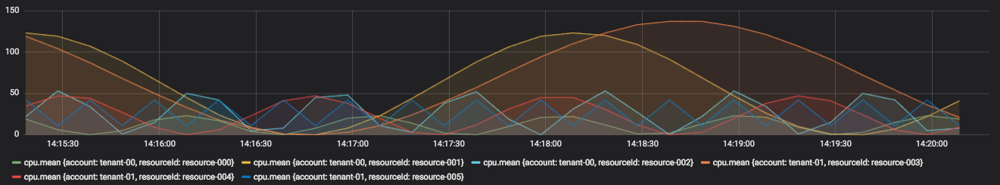

This application generates metrics with random sine-wave shapes in order to test parts of the
system that need metrics that deterministically rise and fall in values, such as the event engine.
The metrics are sent as JSON encoding of `ExternalMetric`s defined by `umb-protocol`. The metrics
are sent to Kafka on the topic configured via `MetricsGenProperties`.

This application can be configured to generate variations of
- the number of tenants
- the number of resources per tenant
- the measurements per resource (such as cpu, memory, filesystem)
- the fields within the measurements (such as used, total, value)

For example, the following will simulate 2 tenants each with 3 resources. Those resources will
emit three measurements (cpu,memory,filesystem) each with the fields used and total.

```yaml
gen:
  tenants: 2
  resources-per-tenant: 3
  fields: used,total
  metrics: cpu,memory,filesystem
```

The following line chart shows an example of what would be generated from the example config:

